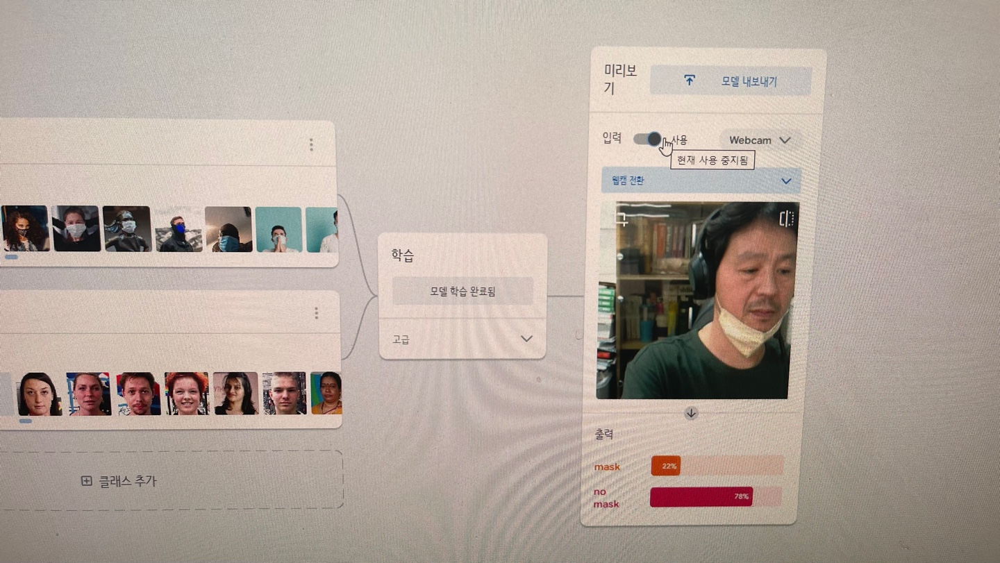

# 2022 서울하드웨어해커톤 
---
1. [팀명 및 팀원](#팀명-및-팀원)
2. [프로젝트 제목](#프로젝트-제목) 
3. [프로젝트 배경 및 목적](#프로젝트-배경-및-목적)
5. [파일리스트](#파일리스트)
6. [코드 기여자](#코드-기여자)
7. [보드](#보드)
8. [구현 사항 가산점](#구현-사항-가산점)

[별첨](#별첨)

---

## 팀명 및 팀원
- 팀명: WNB
- 팀원 
   
이름|역할
---|---
황해연|기획/설계/개발(하드웨어/소프트웨어)
김민전|개발(소프트웨어)
황인규|기획/테스트
황인후|테스트

---

## 프로젝트 제목

**마스크 착용 감지기 (Face Mask Detection)**

---

## 프로젝트 배경 및 목적 
#### 배경
- 다시 시작된 코로나 재 확산, 사회적거리두기 소홀
- 마스크 미착용 사례 다수 발생
- 이전과 같은 온라인, 비대민 환경으로의 회귀는 불가한 상황
- 장치를 활용한 비대면 커뮤니케이션 환경 조성

#### 하고자 하는것
- 특정장소에서 방문한 소비자들의 마스크착용여부를 감지하고 권고
- **마스크감지기**
    - 마스크 착용시

    - 마스크 미착용시

---

## 파일리스트
  
#### 마스크감지기 [[github]](https://github.com/pushdown99/face_mask_detect)
~~~console
├─lib
│  ├─main.dart
│  ├─firebase_options.dart
├─assets
│  └─mask.png
│  └─model.tflite
│  └─labels.txt
├─assets
~~~

- 소스파일 및 자원 (*.dart, *.yaml)

파일명|내용
---|---
lib/main.dart|앱 UI/UX 및 카메라(프리뷰 및 기타) 컨트롤, 기계학습 및 모델 연동 
assets/mask.png|launcher icon
assets/model.tflite|학습된 모델 (Tensorflow lite)
assets/labels.txt|학습된모델의 분류라벨

## 코드 기여자 

#### 소음감지카메라

- 헤더파일(*.h)

파일명|기여자
---|---
lib/main.dart|황해연 
assets/mask.png|-
assets/model.tflite|황해연
assets/labels.txt|황해연

## 보드 

구현보드|목적|소스위치
:---|:---|:---
Tinkerboard Edge R|마스크감지기본체 - 영상처리 - 얼굴인식 - 마스크착용여부감지|[https://github.com/pushdown99/sound-camera/tree/master/camera](https://github.com/pushdown99/sound-camera/tree/master/camera)  

